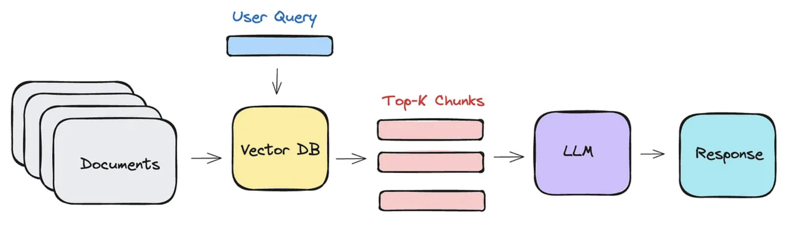

<div align="center">
  
</div>

# AI blueprint

A blueprint for AI development, focusing on applied examples of RAG, information extraction, and more in the age of LLMs and agents. It is a practical approach that strives to show the application of some of the more theoretical learnings from [the smol-course](https://github.com/huggingface/smol-course) and apply them to an end2end real-world example.

> 🚀 Web apps and microservices included!
>
> Each notebook will show how to deploy your AI as a [webapp on Hugging Face Spaces with Gradio](https://huggingface.co/docs/hub/en/spaces-sdks-gradio), which you can directly use as microservices through [the Gradio Python Client](https://www.gradio.app/guides/getting-started-with-the-python-client). All the code and demos can be used in a private or public setting. [Deployed on the Hub!](https://huggingface.co/ai-blueprint)

## The problem statement

We are a company want to build AI tools but we are **not sure where to start**, let alone how to get things done. We only know that **we have a lot of valuable data** and that AI could help us get more value out of it. We have uploaded them to [ai-blueprint/fineweb-bbc-news](https://huggingface.co/datasets/ai-blueprint/fineweb-bbc-news) on the Hugging Face Hub and want to use it to start building our AI stack.

> Hugging Manager: "Establish a baseline and iterate from there!"

### Retrieval Augmented Generation (RAG)

RAG (Retrieval Augmented Generation) is a technique that helps AI give better answers by first finding and using relevant information from your documents. Think of it like giving an AI assistant access to your company's knowledge base before asking it questions - this helps it provide more accurate and factual responses based on your actual data.



#### Some use cases

- Ask questions like "What was our Q4 revenue?" and get answers backed by financial reports
- Search with natural queries like "Show me customer complaints about shipping delays"
- Get AI responses that cite specific policies from your employee handbook
- Ensure accuracy by having AI reference your product documentation when answering technical questions
- Automatically incorporate new sales data and market reports into AI responses
- Build customer service bots that know your exact return policies and procedures

#### How to do RAG?

All notebooks for RAG can be found in the [RAG directory](./rag) and all artifacts can be found in the [RAG collection on the Hub](https://huggingface.co/collections/ai-blueprint/retrieval-augemented-generation-rag-6790c9f597b02c043cfbf7af).

| Status | Notebook | Artifact | Title |
|---------|----------|-----------|-------|
| ✅ | [Retrieve](./rag/retrieve.ipynb) | [Data](https://huggingface.co/datasets/ai-blueprint/fineweb-bbc-news-text-embeddings) - [API](https://ai-blueprint-rag-retrieve.hf.space/?view=api) | Retrieve documents from a vector database |
| ✅ | [Augment](./rag/augment.ipynb) | [API](https://ai-blueprint-rag-augment.hf.space/?view=api) | Augment retrieval results by reranking |
| 🚧 | [Generate](./rag/generate.ipynb) | API | Generating responses with a SmolLM |
| 🚧 | [Pipeline](./rag/pipeline.ipynb) | API | Combine all the components in a RAG pipeline |
| 🚧 | [Monitoring](./rag/monitoring.ipynb) | Data | Monitoring and improving your pipeline |
| 🚧 | [Fine-tuning](./rag/fine_tuning.ipynb) | Models (retrieval and reranking) | Fine-tuning retrieval and reranking models |
| 🚧 | [Agentic RAG](./agents/rag.ipynb) | API | Building agents to coordinate components |

### Information Extraction and labelling

Information Extraction (IE) is the process of extracting structured information from unstructured text. It involves identifying and extracting specific pieces of information, such as names, dates, numbers, and other data points, and organizing them into a structured format. Labeling is the process of annotating the extracted information with metadata, such as entity type, category, or sentiments.

#### Some use cases

- Extract customer names, addresses, and purchase amounts from invoices
- Automatically tag emails with categories like "spam" or "important"
- Extract dates, times, and locations from meeting notes
- Identify and extract entities like people, organizations, and locations from text
- Determine relationships between entities like person-organization connections
- Extract numerical values and units from scientific papers
- Extract product names, prices, and descriptions from online reviews

#### How to do IE?

| Status | Notebook | Artifact | Title |
|---------|----------|-----------|-------|
| 🚧 | [Labeling for classification](./extraction/classification.ipynb) | API - Data | Labeling text for text classification and entity extraction |
| 🚧 | [Labeling for entity extraction](./extraction/entity_extraction.ipynb) | API - Data | Labeling text for text classification and entity extraction |
| 🚧 | [Structured Generation](./extraction/building.ipynb) | API | Structured generation using an LLM |
| 🚧 | [Information Extraction](./extraction/extraction.ipynb) | API - Data | Extract structured information from unstructured text |
| 🚧 | [Agentic Extraction and Labeling](./agents/extraction.ipynb) | API | Building agents to coordinate components |

# Installation and configuration

## Python environment

We will use [uv](https://docs.astral.sh/uv/) to manage the project. First create a virtual environment:

```bash
uv venv --python 3.11
source .venv/bin/activate
```

Then you can install all the required dependencies:

```bash
uv sync --all-groups
```

Or you can sync between different dependency groups:

```bash
uv sync scraping
uv sync rag
uv sync information-extraction
```

## Hugging Face Account

You will need a Hugging Face account to use the Hub API. You can create one [here](https://huggingface.co/join). After this you can follow the [huggingface-cli instructions](https://huggingface.co/docs/huggingface_hub/installation#huggingface-cli) and log in to configure your Hugging Face token.

```bash
huggingface-cli login
```

